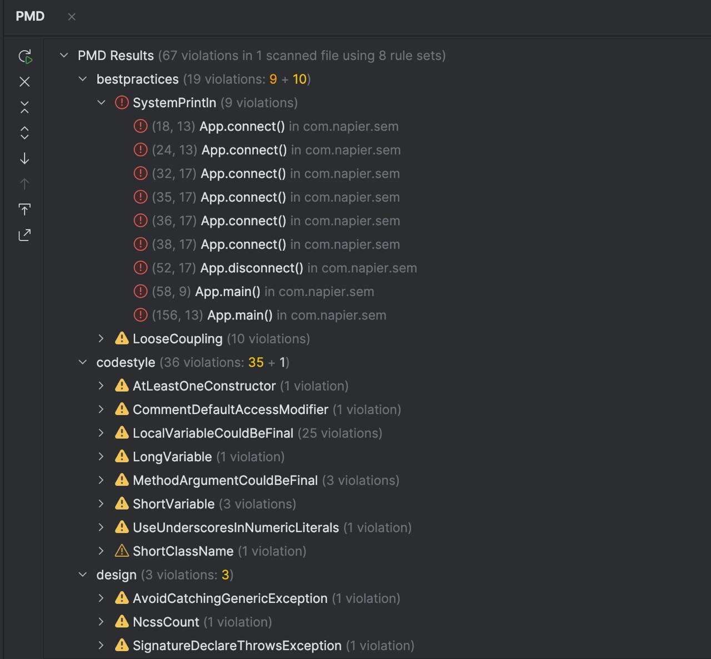
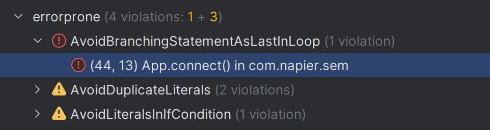
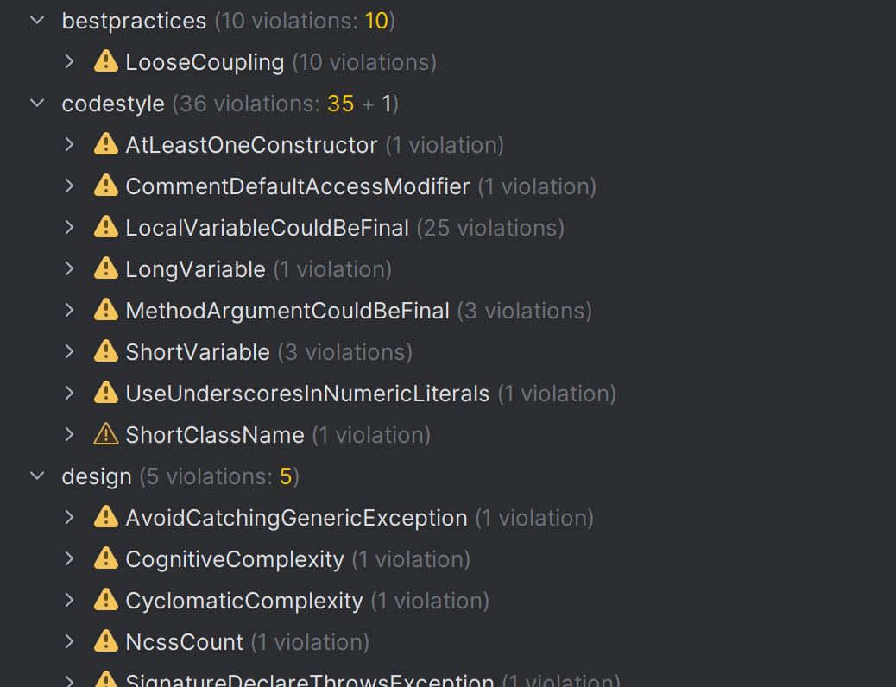

# Code Quality Analysis: PMD and ErrorProne

ErrorProne lists several issues in the code, including AvoidBranchingStatementAsLastInLoop and duplicate literals that became visible after code changes.

PMD highlights many best practice warnings in App.java, such as heavy use of SystemPrintln and looser coupling between components.

Additional PMD results show a wide range of style, design, documentation, and performance warnings, like using short variable names, missing comments or constructors, and code blocks that could be improved.

# Details of Recent Code Modifications

## Logging and Output:

Most System.out.println statements were replaced with LOGGER calls, resulting in more PMD flagging for how outputs and logging are handled.

## Exception handling: 

Improved exception handling for database activity. 

Method signatures were updated with throws Exception to match actual behavior, making exception paths clearer but also triggering design warnings.

## Loop and Branch Logic: 

Changed retry loops for database connection logic, putting a break at the end. This led ErrorProne to warn about having branching statements at the end of loops.

## Rule Coverage: 

The codebase is now checked with a wider set of PMD and ErrorProne rules, so more types of code quality issues are visible in the scans.