This is the group repository for Group 20.
Edited
Testing for CI

# Master

# Develop

# Codecov

32 requirements of 32 have been implemented, which is 100%.
| ID |                                                                                               Name                                                                                                | Met |                                                                                                    Screenshot |
|----|:-------------------------------------------------------------------------------------------------------------------------------------------------------------------------------------------------:|----:|--------------------------------------------------------------------------------------------------------------:|
| 1  |                                                            All the countries in the world organised by largest population to smallest.                                                            | Yes |           | 
| 2  |                                                           All the countries in a continent organised by largest population to smallest.                                                           | Yes |      |
| 3  |                                                            All the countries in a region organised by largest population to smallest.                                                             | Yes |         |
| 4  |                                                            The top N populated countries in the world where N is provided by the user.                                                            | Yes |    |
| 5  |                                                           The top N populated countries in a continent where N is provided by the user.                                                           | Yes |  |
| 6  |                                                            The top N populated countries in a region where N is provided by the user.                                                             | Yes |     |
| 7  |                                                             All the cities in the world organised by largest population to smallest.                                                              | Yes |                                               |
| 8  |                                                            All the cities in a continent organised by largest population to smallest.                                                             | Yes |                                               |
| 9  |                                                              All the cities in a region organised by largest population to smallest.                                                              | Yes |                                               |
| 10 |                                                             All the cities in a country organised by largest population to smallest.                                                              | Yes |                                               |
| 11 |                                                             All the cities in a district organised by largest population to smallest.                                                             | Yes |                                               | 
| 12 |                                                             The top N populated cities in the world where N is provided by the user.                                                              | Yes |                                                                      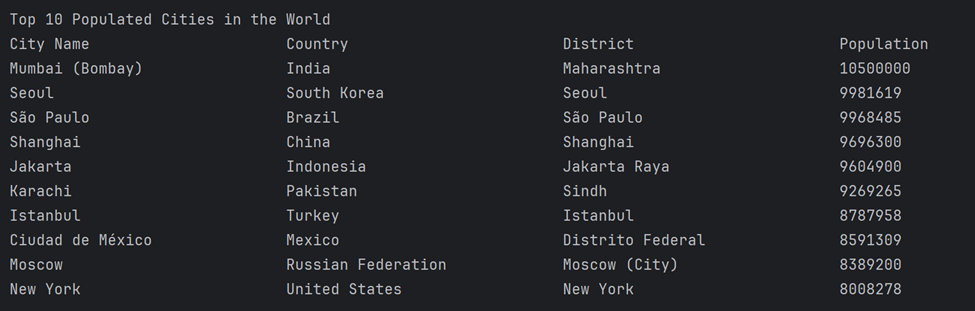 |
| 13 |                                                            The top N populated cities in a continent where N is provided by the user.                                                             | Yes |                                                                         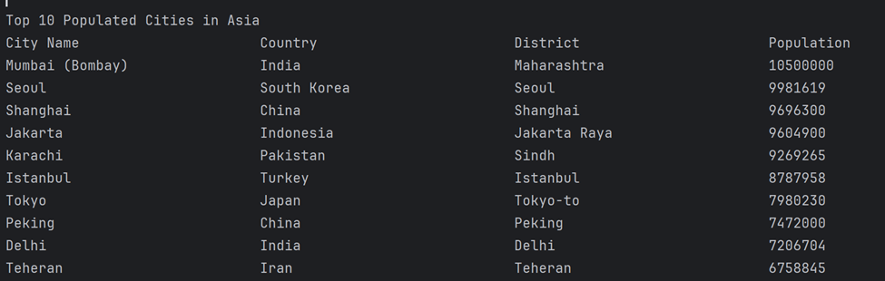 |
| 14 |                                                              The top N populated cities in a region where N is provided by the user.                                                              | Yes |                                                                  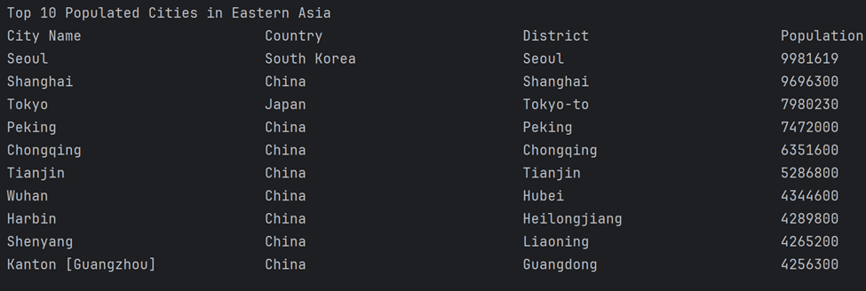 |
| 15 |                                                             The top N populated cities in a country where N is provided by the user.                                                              | Yes |                                                                        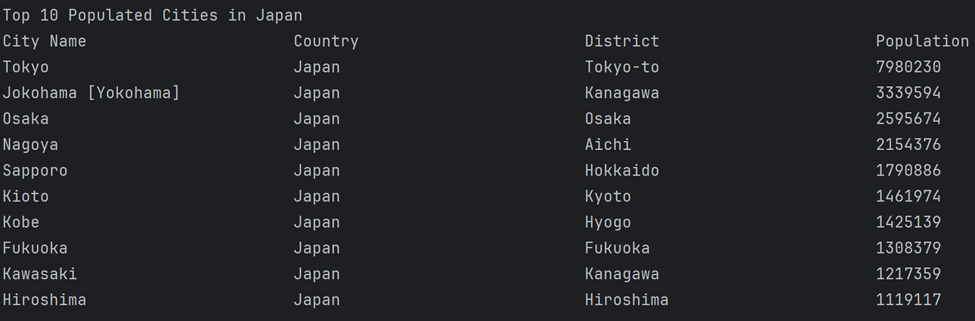 |
| 16 |                                                             The top N populated cities in a district where N is provided by the user.                                                             | Yes |                                                                     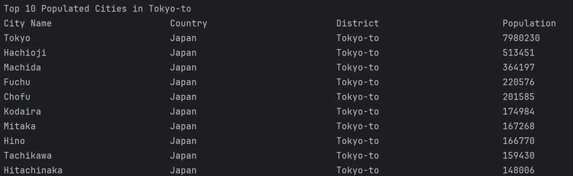 |
| 17 |                                                         All the capital cities in the world organised by largest population to smallest.                                                          | Yes |                                                             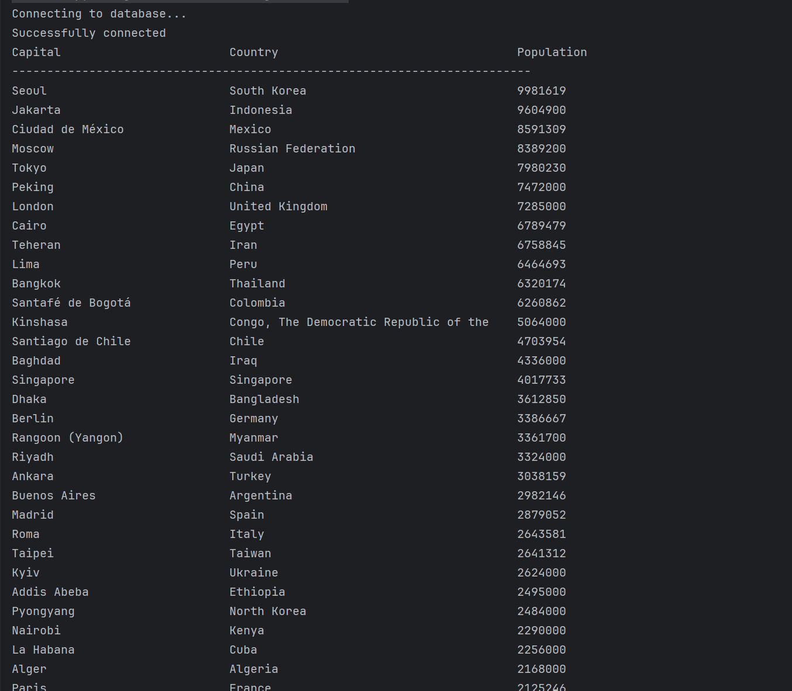 |
| 18 |                                                        All the capital cities in a continent organised by largest population to smallest.                                                         | Yes |                                                             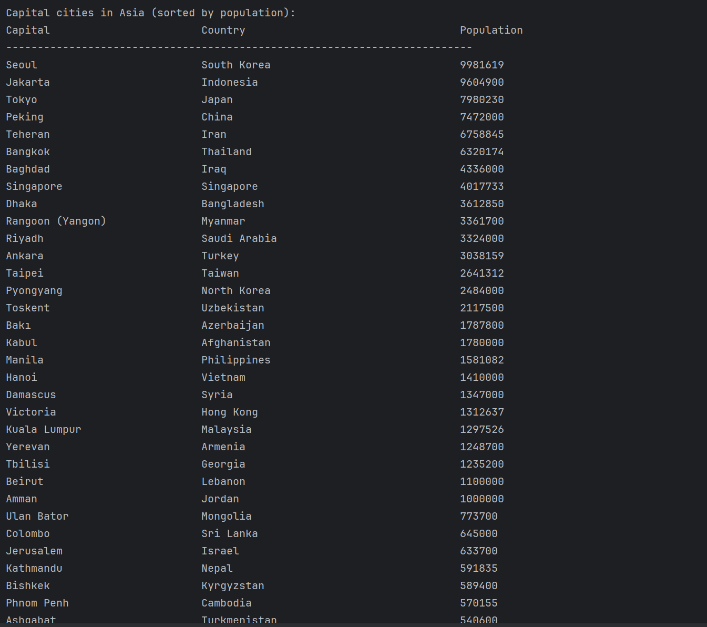 |
| 19 |                                                               All the capital cities in a region organised by largest to smallest.                                                                | Yes |                                                             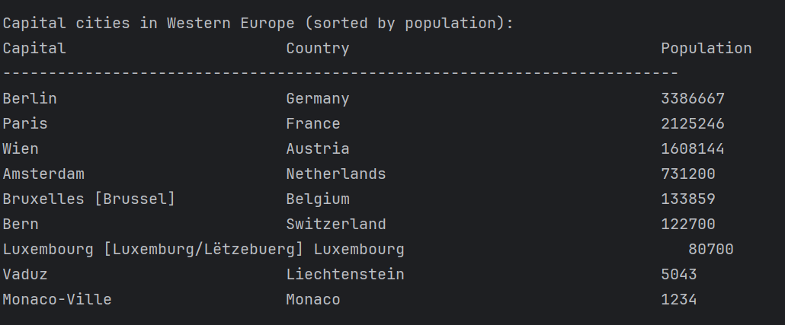 |
| 20 |                                                         The top N populated capital cities in the world where N is provided by the user.                                                          | Yes |                                                             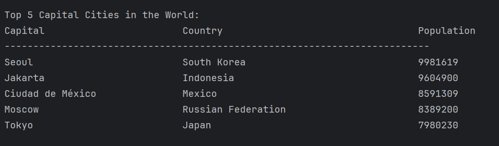 |
| 21 |                                                         The top N populated capital cities in the world where N is provided by the user.                                                          | Yes |                                                             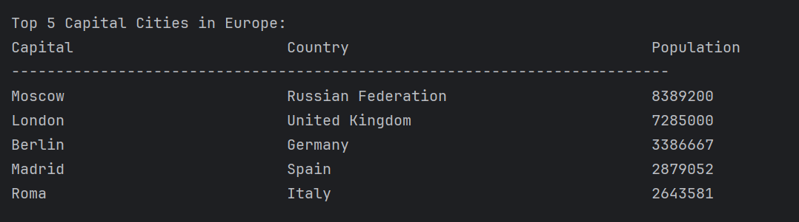 | 
| 22 |                                                          The top N populated capital cities in a region where N is provided by the user.                                                          | Yes |                                                             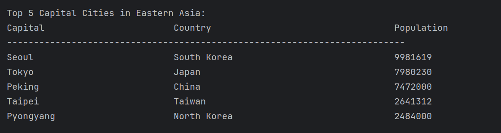 |
| 23 |                                               The population of people, people living in cities, and people not living in cities in each continent.                                               | Yes |                                              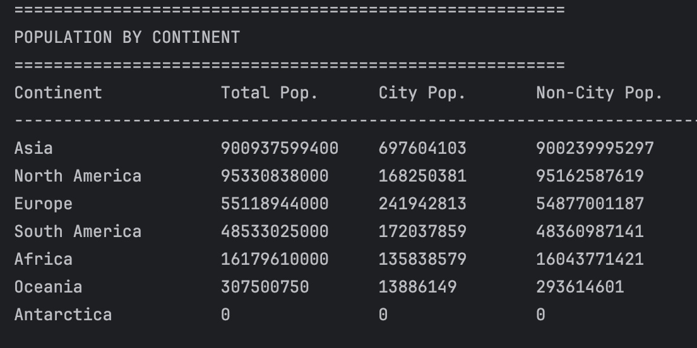 |
| 24 |                                                The population of people, people living in cities, and people not living in cities in each region.                                                 | Yes |                                                    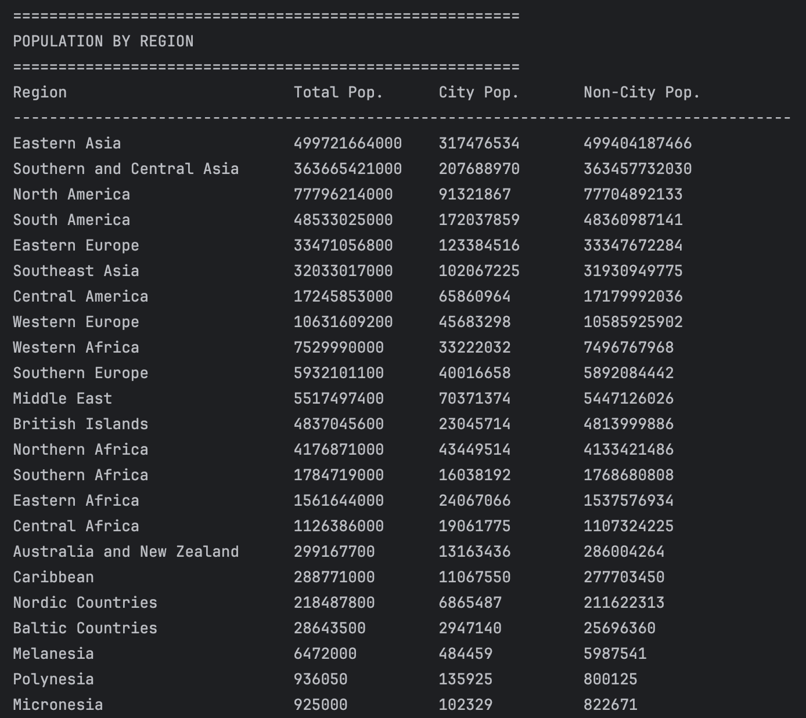 |
| 25 |                                                The population of people, people living in cities, and people not living in cities in each country.                                                | Yes |                                                  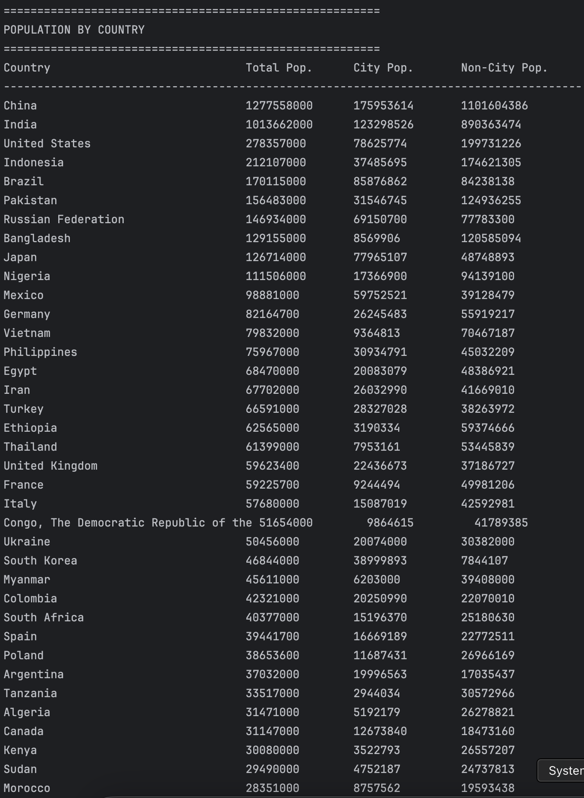 |
| 26 |                                                                                   The population of the world.                                                                                    | Yes |                                                   |
| 27 |                                                                                  The population of a continent.                                                                                   | Yes |                                                 |
| 28 |                                                                                    The population of a region.                                                                                    | Yes |                                                    |
| 29 |                                                                                   The population of a country.                                                                                    | Yes |                                                   |
| 30 |                                                                                   The population of a district.                                                                                   | Yes |                                                  |
| 31 |                                                                                     The population of a city.                                                                                     | Yes |                                                      |
| 32 | The number of people who speak the following the following languages from greatest number to smallest, including the percentage of the world population: Chinese, English, Hindi, Spanish, Arabic | Yes |                                                             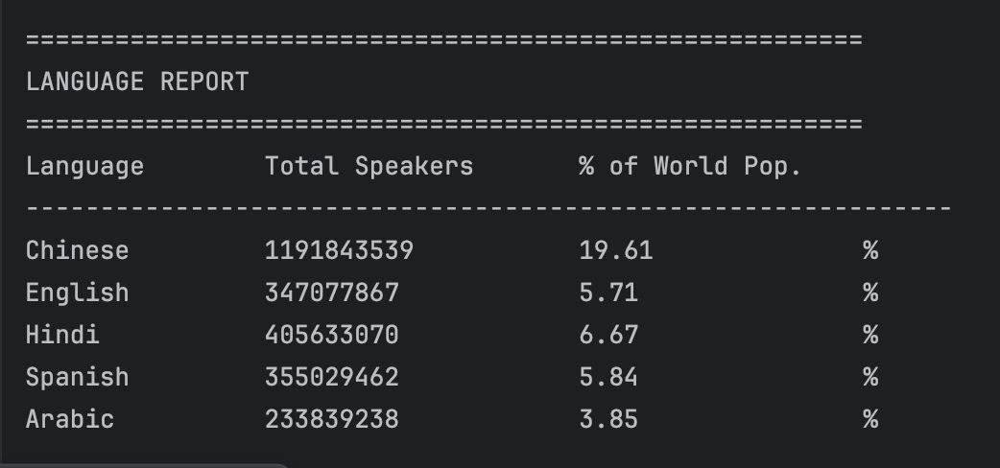 |